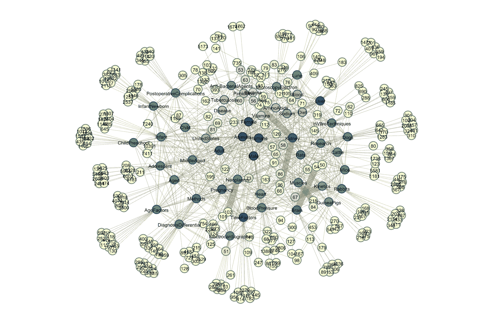
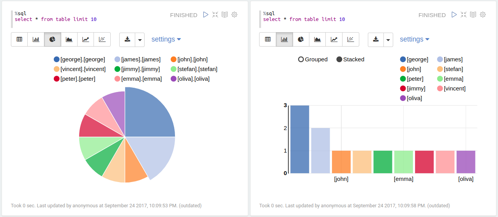
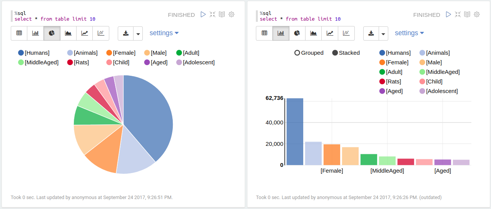
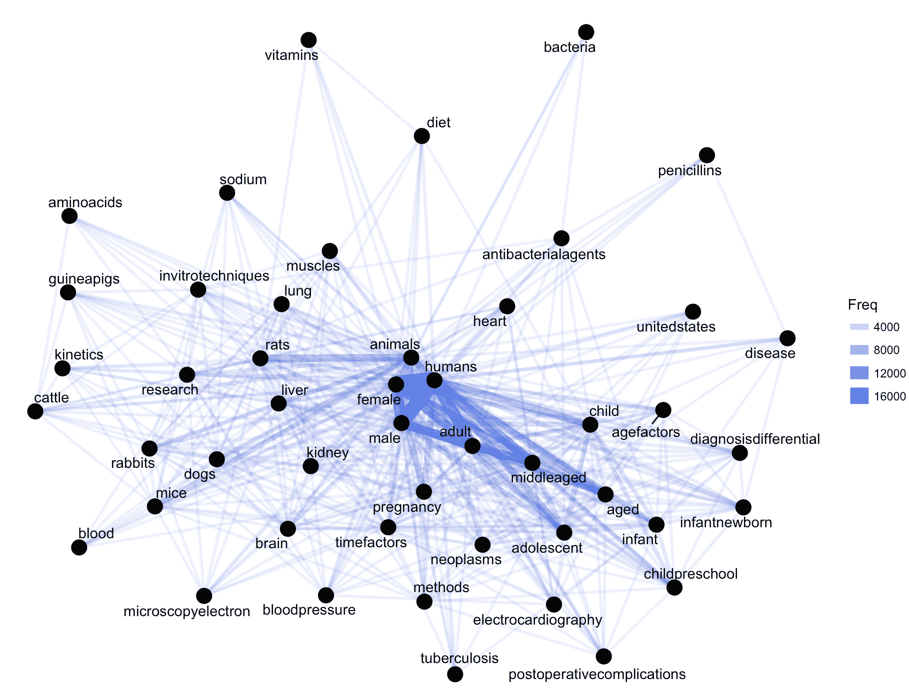

# 14\. Social Network Analysis

Chinese proverb

**A Touch of Cloth,linked in countless ways.** – old Chinese proverb



## 14.1\. Introduction

<iframe width="560" height="315" src="https://www.youtube.com/embed/xT3EpF2EsbQ" frameborder="0" allowfullscreen=""></iframe>

## 14.2\. Co-occurrence Network

[Co-occurrence networks](https://en.wikipedia.org/wiki/Co-occurrence_networks) are generally used to provide a graphic visualization of potential relationships between people, organizations, concepts or other entities represented within written material. The generation and visualization of co-occurrence networks has become practical with the advent of electronically stored text amenable to text mining.

### 14.2.1\. Methodology

*   Build Corpus C
*   Build Document-Term matrix D based on Corpus C
*   Compute Term-Document matrix 
*   Adjacency Matrix 

There are four main components in this algorithm in the algorithm: Corpus C, Document-Term matrix D, Term-Document matrix  and Adjacency Matrix A. In this demo part, I will show how to build those four main components.

Given that we have three groups of friends, they are

> ```
> +-------------------------------------+
> |words                                |
> +-------------------------------------+
> |[[george] [jimmy] [john] [peter]]    |
> |[[vincent] [george] [stefan] [james]]|
> |[[emma] [james] [olivia] [george]]   |
> +-------------------------------------+
> 
> ```

1.  Corpus C

Then we can build the following corpus based on the unique elements in the given group data:

> ```
> [u'george', u'james', u'jimmy', u'peter', u'stefan', u'vincent', u'olivia', u'john', u'emma']
> 
> ```

The corresponding elements frequency:

> 

1.  Document-Term matrix D based on Corpus C (CountVectorizer)

> ```
> from pyspark.ml.feature import CountVectorizer
> count_vectorizer_wo = CountVectorizer(inputCol='term', outputCol='features')
> # with total unique vocabulary
> countVectorizer_mod_wo = count_vectorizer_wo.fit(df)
> countVectorizer_twitter_wo = countVectorizer_mod_wo.transform(df)
> # with truncated unique vocabulary (99%)
> count_vectorizer = CountVectorizer(vocabSize=48,inputCol='term',outputCol='features')
> countVectorizer_mod = count_vectorizer.fit(df)
> countVectorizer_twitter = countVectorizer_mod.transform(df)
> 
> ```
> 
> ```
> +-------------------------------+
> |features                       |
> +-------------------------------+
> |(9,[0,2,3,7],[1.0,1.0,1.0,1.0])|
> |(9,[0,1,4,5],[1.0,1.0,1.0,1.0])|
> |(9,[0,1,6,8],[1.0,1.0,1.0,1.0])|
> +-------------------------------+
> 
> ```

*   Term-Document matrix 

> RDD:
> 
> ```
> [array([ 1.,  1.,  1.]), array([ 0.,  1.,  1.]), array([ 1.,  0.,  0.]),
>  array([ 1.,  0.,  0.]), array([ 0.,  1.,  0.]), array([ 0.,  1.,  0.]),
>  array([ 0.,  0.,  1.]), array([ 1.,  0.,  0.]), array([ 0.,  0.,  1.])]
> 
> ```
> 
> Matrix:
> 
> ```
> array([[ 1.,  1.,  1.],
>        [ 0.,  1.,  1.],
>        [ 1.,  0.,  0.],
>        [ 1.,  0.,  0.],
>        [ 0.,  1.,  0.],
>        [ 0.,  1.,  0.],
>        [ 0.,  0.,  1.],
>        [ 1.,  0.,  0.],
>        [ 0.,  0.,  1.]])
> 
> ```

1.  Adjacency Matrix 

> RDD:
> 
> ```
> [array([ 1.,  1.,  1.]), array([ 0.,  1.,  1.]), array([ 1.,  0.,  0.]),
>  array([ 1.,  0.,  0.]), array([ 0.,  1.,  0.]), array([ 0.,  1.,  0.]),
>  array([ 0.,  0.,  1.]), array([ 1.,  0.,  0.]), array([ 0.,  0.,  1.])]
> 
> ```
> 
> Matrix:
> 
> ```
> array([[ 3.,  2.,  1.,  1.,  1.,  1.,  1.,  1.,  1.],
>        [ 2.,  2.,  0.,  0.,  1.,  1.,  1.,  0.,  1.],
>        [ 1.,  0.,  1.,  1.,  0.,  0.,  0.,  1.,  0.],
>        [ 1.,  0.,  1.,  1.,  0.,  0.,  0.,  1.,  0.],
>        [ 1.,  1.,  0.,  0.,  1.,  1.,  0.,  0.,  0.],
>        [ 1.,  1.,  0.,  0.,  1.,  1.,  0.,  0.,  0.],
>        [ 1.,  1.,  0.,  0.,  0.,  0.,  1.,  0.,  1.],
>        [ 1.,  0.,  1.,  1.,  0.,  0.,  0.,  1.,  0.],
>        [ 1.,  1.,  0.,  0.,  0.,  0.,  1.,  0.,  1.]])
> 
> ```

### 14.2.2\. Coding Puzzle from my interview

*   Problem

The attached utf-8 encoded text file contains the tags associated with an online biomedical scientific article formatted as follows (size: 100000). Each Scientific article is represented by a line in the file delimited by carriage return.

> ```
> +--------------------+
> |               words|
> +--------------------+
> |[ACTH Syndrome, E...|
> |[Antibody Formati...|
> |[Adaptation, Phys...|
> |[Aerosol Propella...|
> +--------------------+
> only showing top 4 rows
> 
> ```

Write a program that, using this file as input, produces a list of pairs of tags which appear TOGETHER in any order and position in at least fifty different Scientific articles. For example, in the above sample, [Female] and [Humans] appear together twice, but every other pair appears only once. Your program should output the pair list to stdout in the same form as the input (eg tag 1, tag 2n).

*   My solution

> The corresponding words frequency:
> 
> &gt; 
> &gt; 
> &gt; Word frequency
> 
> Output:
> 
> ```
> +----------+------+-------+
> |    term.x|term.y|   freq|
> +----------+------+-------+
> |    Female|Humans|16741.0|
> |      Male|Humans|13883.0|
> |     Adult|Humans|10391.0|
> |      Male|Female| 9806.0|
> |MiddleAged|Humans| 8181.0|
> |     Adult|Female| 7411.0|
> |     Adult|  Male| 7240.0|
> |MiddleAged|  Male| 6328.0|
> |MiddleAged|Female| 6002.0|
> |MiddleAged| Adult| 5944.0|
> +----------+------+-------+
> only showing top 10 rows
> 
> ```

The corresponding Co-occurrence network:

> 
> 
> Co-occurrence network

Then you will get Figure [Co-occurrence network](#fig-netfreq)

## 14.3\. Appendix: matrix multiplication in PySpark

1.  load test matrix

```
df = spark.read.csv("matrix1.txt",sep=",",inferSchema=True)
df.show()

```

```
+---+---+---+---+
|_c0|_c1|_c2|_c3|
+---+---+---+---+
|1.2|3.4|2.3|1.1|
|2.3|1.1|1.5|2.2|
|3.3|1.8|4.5|3.3|
|5.3|2.2|4.5|4.4|
|9.3|8.1|0.3|5.5|
|4.5|4.3|2.1|6.6|
+---+---+---+---+

```

1.  main function for matrix multiplication in PySpark

```
from pyspark.sql import functions as F
from functools import reduce
# reference: https://stackoverflow.com/questions/44348527/matrix-multiplication-at-a-in-pyspark
# do the sum of the multiplication that we want, and get
# one data frame for each column
colDFs = []
for c2 in df.columns:
    colDFs.append( df.select( [ F.sum(df[c1]*df[c2]).alias("op_{0}".format(i)) for i,c1 in enumerate(df.columns) ] ) )
# now union those separate data frames to build the "matrix"
mtxDF = reduce(lambda a,b: a.select(a.columns).union(b.select(a.columns)), colDFs )
mtxDF.show()

```

```
+------------------+------------------+------------------+------------------+
|              op_0|              op_1|              op_2|              op_3|
+------------------+------------------+------------------+------------------+
|            152.45|118.88999999999999|             57.15|121.44000000000001|
|118.88999999999999|104.94999999999999|             38.93|             94.71|
|             57.15|             38.93|52.540000000000006|             55.99|
|121.44000000000001|             94.71|             55.99|110.10999999999999|
+------------------+------------------+------------------+------------------+

```

1.  Validation with python version

```
import numpy as np
a = np.genfromtxt("matrix1.txt",delimiter=",")
np.dot(a.T, a)

```

```
array([[152.45, 118.89,  57.15, 121.44],
       [118.89, 104.95,  38.93,  94.71],
       [ 57.15,  38.93,  52.54,  55.99],
       [121.44,  94.71,  55.99, 110.11]])

```

## 14.4\. Correlation Network

TODO ..