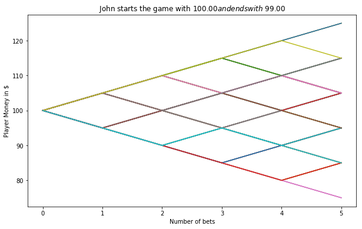
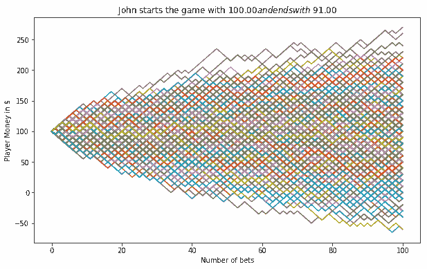
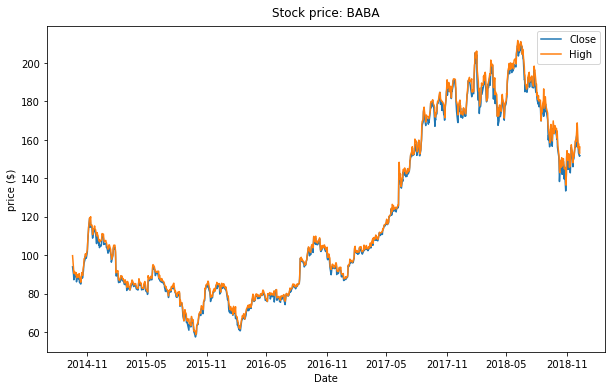
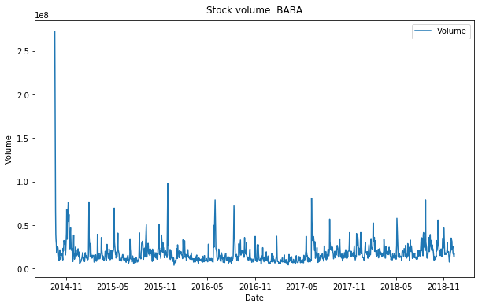
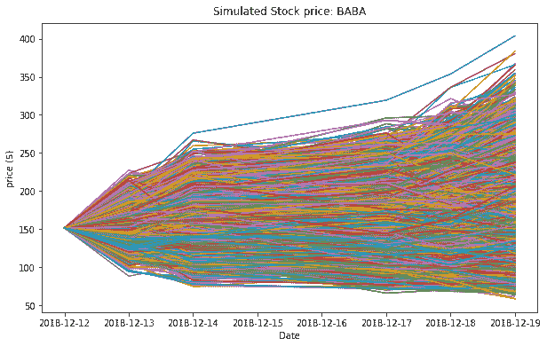
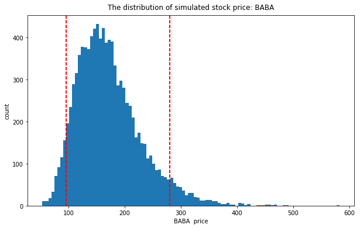

# 16\. Monte Carlo Simulation


Monte Carlo simulations are just a way of estimating a fixed parameter by repeatedly generating random numbers. More details can be found at [A Zero Math Introduction to Markov Chain Monte Carlo Methods](https://towardsdatascience.com/a-zero-math-introduction-to-markov-chain-monte-carlo-methods-dcba889e0c50).

Monte Carlo simulation is a technique used to understand the impact of risk and uncertainty in financial, project management, cost, and other forecasting models. A Monte Carlo simulator helps one visualize most or all of the potential outcomes to have a better idea regarding the risk of a decision. More details can be found at [The house always wins](https://towardsdatascience.com/the-house-always-wins-monte-carlo-simulation-eb82787da2a3).

## 16.1\. Simulating Casino Win

We assume that the player John has the 49% chance to win the game and the wager will be $5 per game.

```
import numpy as np
import pandas as pd
import matplotlib.pyplot as plt

start_m =100
wager = 5
bets = 100
trials = 1000

trans = np.vectorize(lambda t: -wager if t <=0.51 else wager)

fig = plt.figure(figsize=(10, 6))
ax = fig.add_subplot(1,1,1)

end_m = []

for i in range(trials):
    money = reduce(lambda c, x: c + [c[-1] + x], trans(np.random.random(bets)), [start_m])
    end_m.append(money[-1])
    plt.plot(money)

plt.ylabel('Player Money in $')
plt.xlabel('Number of bets')
plt.title(("John starts the game with $ %.2f and ends with $ %.2f")%(start_m,sum(end_m)/len(end_m)))
plt.show()

```

 

## 16.2\. Simulating a Random Walk

### 16.2.1\. Fetch the histrical stock price

1.  Fecth the data. If you need the code for this piece, you can contact with me.

```
stock.tail(4)

+----------+----------+----------+----------+----------+----------+--------+
|      Date|      Open|      High|       Low|     Close| Adj Close|  Volume|
+----------+----------+----------+----------+----------+----------+--------+
|2018-12-07|155.399994|158.050003|151.729996|153.059998|153.059998|17447900|
|2018-12-10|150.389999|152.809998|147.479996|151.429993|151.429993|15525500|
|2018-12-11|155.259995|156.240005|150.899994|151.830002|151.830002|13651900|
|2018-12-12|155.240005|156.169998|151.429993|     151.5|     151.5|16597900|
+----------+----------+----------+----------+----------+----------+--------+

```

1.  Convert the `str` type date to date type

```
stock['Date'] = pd.to_datetime(stock['Date'])

```

1.  Data visualization

```
# Plot everything by leveraging the very powerful matplotlib package
width = 10
height = 6
data = stock
fig = plt.figure(figsize=(width, height))
ax = fig.add_subplot(1,1,1)
ax.plot(data.Date, data.Close, label='Close')
ax.plot(data.Date, data.High, label='High')
# ax.plot(data.Date, data.Low, label='Low')
ax.set_xlabel('Date')
ax.set_ylabel('price ($)')
ax.legend()
ax.set_title('Stock price: ' + ticker, y=1.01)
#plt.xticks(rotation=70)
plt.show()
# Plot everything by leveraging the very powerful matplotlib package
fig = plt.figure(figsize=(width, height))
ax = fig.add_subplot(1,1,1)
ax.plot(data.Date, data.Volume, label='Volume')
#ax.plot(data.Date, data.High, label='High')
# ax.plot(data.Date, data.Low, label='Low')
ax.set_xlabel('Date')
ax.set_ylabel('Volume')
ax.legend()
ax.set_title('Stock volume: ' + ticker, y=1.01)
#plt.xticks(rotation=70)
plt.show()

```



Historical Stock Price



Historical Stock Volume

### 16.2.2\. Calulate the Compound Annual Growth Rate

The formula for Compound Annual Growth Rate (CAGR) is very useful for investment analysis. It may also be referred to as the annualized rate of return or annual percent yield or effective annual rate, depending on the algebraic form of the equation. Many investments such as stocks have returns that can vary wildly. The CAGR formula allows you to calculate a “smoothed” rate of return that you can use to compare to other investments. The formula is defined as (more details can be found at [CAGR Calculator and Formula](https://www.vertex42.com/Calculators/cagr-calculator.html))


```
days =  (stock.Date.iloc[-1] - stock.Date.iloc[0]).days
cagr = ((((stock['Adj Close'].iloc[-1]) / stock['Adj Close'].iloc[0])) ** (365.0/days)) - 1
print ('CAGR =',str(round(cagr,4)*100)+"%")
mu = cagr

```

### 16.2.3\. Calulate the annual volatility

A stock’s volatility is the variation in its price over a period of time. For example, one stock may have a tendency to swing wildly higher and lower, while another stock may move in much steadier, less turbulent way. Both stocks may end up at the same price at the end of day, but their path to that point can vary wildly. First, we create a series of percentage returns and calculate the annual volatility of returns Annualizing volatility. To present this volatility in annualized terms, we simply need to multiply our daily standard deviation by the square root of 252\. This assumes there are 252 trading days in a given year. More details can be found at [How to Calculate Annualized Volatility](https://www.fool.com/knowledge-center/how-to-calculate-annualized-volatility.aspx).

```
stock['Returns'] = stock['Adj Close'].pct_change()
vol = stock['Returns'].std()*np.sqrt(252)

```

### 16.2.4\. Create matrix of daily returns

1.  Create matrix of daily returns using random normal distribution Generates an RDD matrix comprised of i.i.d. samples from the uniform distribution U(0.0, 1.0).

```
S = stock['Adj Close'].iloc[-1] #starting stock price (i.e. last available real stock price)
T = 5 #Number of trading days
mu = cagr #Return
vol = vol #Volatility
trials = 10000

mat = RandomRDDs.normalVectorRDD(sc, trials, T, seed=1)

```

1.  Transform the distribution in the generated RDD from U(0.0, 1.0) to U(a, b), use RandomRDDs.uniformRDD(sc, n, p, seed) .map(lambda v: a + (b - a) * v)

```
a = mu/T
b = vol/math.sqrt(T)
v = mat.map(lambda x: a +  (b - a)* x)

```

1.  Convert Rdd mstrix to dataframe

```
df = v.map(lambda x: [round(i,6)+1 for i in x]).toDF()
df.show(5)

```

```
+--------+--------+--------+--------+--------+
|      _1|      _2|      _3|      _4|      _5|
+--------+--------+--------+--------+--------+
|0.935234|1.162894| 1.07972|1.238257|1.066136|
|0.878456|1.045922|0.990071|1.045552|0.854516|
|1.186472|0.944777|0.742247|0.940023|1.220934|
|0.872928|1.030882|1.248644|1.114262|1.063762|
| 1.09742|1.188537|1.137283|1.162548|1.024612|
+--------+--------+--------+--------+--------+
only showing top 5 rows

```

```
from pyspark.sql.functions import lit
S = stock['Adj Close'].iloc[-1]
price = df.withColumn('init_price' ,lit(S))

```

```
price.show(5)

+--------+--------+--------+--------+--------+----------+
|      _1|      _2|      _3|      _4|      _5|init_price|
+--------+--------+--------+--------+--------+----------+
|0.935234|1.162894| 1.07972|1.238257|1.066136|     151.5|
|0.878456|1.045922|0.990071|1.045552|0.854516|     151.5|
|1.186472|0.944777|0.742247|0.940023|1.220934|     151.5|
|0.872928|1.030882|1.248644|1.114262|1.063762|     151.5|
| 1.09742|1.188537|1.137283|1.162548|1.024612|     151.5|
+--------+--------+--------+--------+--------+----------+
only showing top 5 rows

```

```
price = price.withColumn('day_0', col('init_price'))
price.show(5)

```

```
+--------+--------+--------+--------+--------+----------+-----+
|      _1|      _2|      _3|      _4|      _5|init_price|day_0|
+--------+--------+--------+--------+--------+----------+-----+
|0.935234|1.162894| 1.07972|1.238257|1.066136|     151.5|151.5|
|0.878456|1.045922|0.990071|1.045552|0.854516|     151.5|151.5|
|1.186472|0.944777|0.742247|0.940023|1.220934|     151.5|151.5|
|0.872928|1.030882|1.248644|1.114262|1.063762|     151.5|151.5|
| 1.09742|1.188537|1.137283|1.162548|1.024612|     151.5|151.5|
+--------+--------+--------+--------+--------+----------+-----+
only showing top 5 rows

```

### 16.2.5\. Monte Carlo Simulation

```
from pyspark.sql.functions import round
for name in price.columns[:-2]:
    price = price.withColumn('day'+name, round(col(name)*col('init_price'),2))
    price = price.withColumn('init_price',col('day'+name))

```

```
price.show(5)

+--------+--------+--------+--------+--------+----------+-----+------+------+------+------+------+
|      _1|      _2|      _3|      _4|      _5|init_price|day_0| day_1| day_2| day_3| day_4| day_5|
+--------+--------+--------+--------+--------+----------+-----+------+------+------+------+------+
|0.935234|1.162894| 1.07972|1.238257|1.066136|    234.87|151.5|141.69|164.77|177.91| 220.3|234.87|
|0.878456|1.045922|0.990071|1.045552|0.854516|    123.14|151.5|133.09| 139.2|137.82| 144.1|123.14|
|1.186472|0.944777|0.742247|0.940023|1.220934|    144.67|151.5|179.75|169.82|126.05|118.49|144.67|
|0.872928|1.030882|1.248644|1.114262|1.063762|    201.77|151.5|132.25|136.33|170.23|189.68|201.77|
| 1.09742|1.188537|1.137283|1.162548|1.024612|     267.7|151.5|166.26|197.61|224.74|261.27| 267.7|
+--------+--------+--------+--------+--------+----------+-----+------+------+------+------+------+
only showing top 5 rows

```

### 16.2.6\. Summary

```
selected_col = [name for name in price.columns if 'day_' in name]

simulated = price.select(selected_col)
simulated.describe().show()

```

```
+-------+----------+------------------+------------------+------------------+------------------+------------------+
|summary|2018-12-12|        2018-12-13|        2018-12-14|        2018-12-17|        2018-12-18|        2018-12-19|
+-------+----------+------------------+------------------+------------------+------------------+------------------+
|  count|   10000.0|           10000.0|           10000.0|           10000.0|           10000.0|           10000.0|
|   mean|     151.5|155.11643700000002|        158.489058|162.23713200000003|        166.049375|        170.006525|
|    std|       0.0|18.313783237787845|26.460919262517276| 33.37780495150803|39.369101074463416|45.148120695490846|
|    min|     151.5|              88.2|             74.54|             65.87|             68.21|             58.25|
|    25%|     151.5|           142.485|            140.15|            138.72|           138.365|            137.33|
|    50%|     151.5|            154.97|           157.175|            159.82|            162.59|165.04500000000002|
|    75%|     151.5|           167.445|175.48499999999999|          182.8625|           189.725|           196.975|
|    max|     151.5|            227.48|            275.94|            319.17|            353.59|            403.68|
+-------+----------+------------------+------------------+------------------+------------------+------------------+

```

```
data_plt = simulated.toPandas()
days = pd.date_range(stock['Date'].iloc[-1], periods= T+1,freq='B').date

width = 10
height = 6
fig = plt.figure(figsize=(width, height))
ax = fig.add_subplot(1,1,1)

days = pd.date_range(stock['Date'].iloc[-1], periods= T+1,freq='B').date

for i in range(trials):
    plt.plot(days, data_plt.iloc[i])
ax.set_xlabel('Date')
ax.set_ylabel('price ($)')
ax.set_title('Simulated Stock price: ' + ticker, y=1.01)
plt.show()

```



### 16.2.7\. One-year Stock price simulation


Simulated Stock Price



Simulated Stock Price distribution