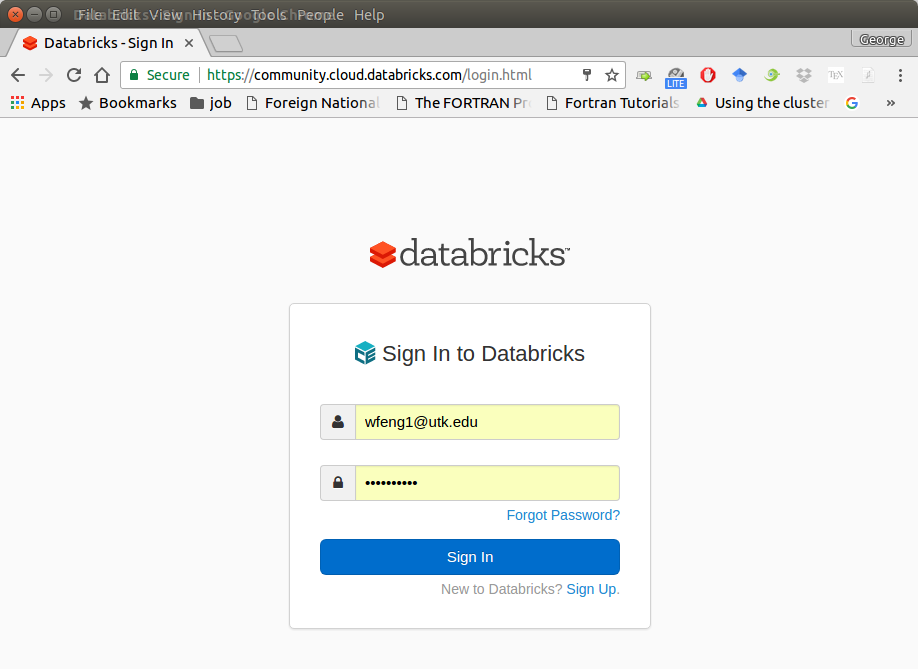
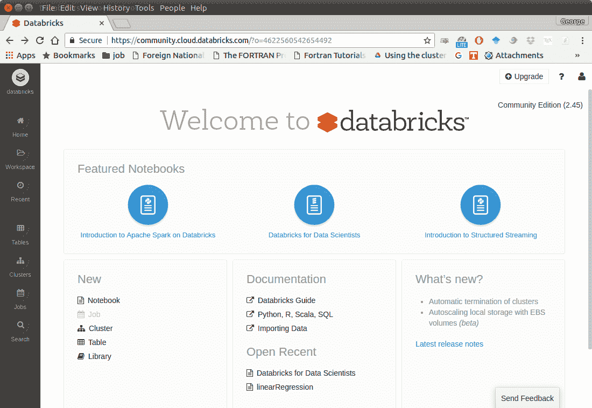

# 3\. 配置运行平台

> **工欲善其事，必先利其器。** – 中国古代谚语

一个好的编程平台可以为您节省大量的麻烦和时间。 在这里，我将仅介绍如何安装我最喜欢的编程平台，并且只展示我在 Linux 系统上设置它的最简单的方法。 如果要在其他操作系统上安装，可以通过搜索引擎。 在本节中，您可以学习如何在相应的编程平台和包上设置 Pyspark。

## 3.1\. 在 Databricks 社区云上运行

如果您对 Linux 或 Unix 操作系统没有任何经验，我很乐意建议您在 Databricks 社区云上使用 Spark。 因为你不需要设置 Spark，它对于社区版来说完全是免费的**。 请按照下面列出的步骤操作。

1.  在 [https://community.cloud.databricks.com/login.html](https://community.cloud.databricks.com/login.html) 建立账户：

    

1.  使用您的帐户登录，然后您可以创建集群（计算机），表（数据集）和笔记本（代码）。

    

1.  创建运行代码的集群

    

1.  导入你的数据集

    
    
    

    > 注意
    > 
    > 您需要保存`Uploaded to DBFS`中显示的路径: `/FileStore/tables/05rmhuqv1489687378010/`，由于我们会使用这个路径来上传数据集。

1.  创建你的笔记本

     
    
    

完成上述 5 个步骤后，您就可以在 Databricks 社区云上运行 Spark 代码了。 我将在 Databricks 社区云上运行以下所有演示。在运行演示代码时，希望您将获得以下结果：

```
+---+-----+-----+---------+-----+
|_c0|   TV|Radio|Newspaper|Sales|
+---+-----+-----+---------+-----+
|  1|230.1| 37.8|     69.2| 22.1|
|  2| 44.5| 39.3|     45.1| 10.4|
|  3| 17.2| 45.9|     69.3|  9.3|
|  4|151.5| 41.3|     58.5| 18.5|
|  5|180.8| 10.8|     58.4| 12.9|
+---+-----+-----+---------+-----+
only showing top 5 rows

root
 |-- _c0: integer (nullable = true)
 |-- TV: double (nullable = true)
 |-- Radio: double (nullable = true)
 |-- Newspaper: double (nullable = true)
 |-- Sales: double (nullable = true)

```

## 3.2\. 在 Mac 和 Ubuntu 上配置 Spark

### 3.2.1\. 安装先决条件

我强烈建议您安装 [Anaconda](https://www.anaconda.com/download/)，因为它包含大部分先决条件并支持多个操作系统。

**安装 Python**

转到 Ubuntu 软件中心并按照以下步骤操作：

1.  打开 Ubuntu 软件中心
2.  搜索 python
3.  并点击“安装”

或者打开终端执行以下命令：

```bash
sudo apt-get install build-essential checkinstall
sudo apt-get install libreadline-gplv2-dev libncursesw5-dev libssl-dev
                 libsqlite3-dev tk-dev libgdbm-dev libc6-dev libbz2-dev
sudo apt-get install python
sudo easy_install pip
sudo pip install ipython

```

### 3.2.2\. 安装 Java

Java 被许多其他软件使用。 所以你很可能已经安装了它。 您可以在命令提示符中使用以下命令：

```bash
java -version

```

否则，您可以按照[如何为我的 Mac 安装 Java？](https://java.com/en/download/help/mac_install.xml)中的步骤，在 Mac 上安装 java 并在命令提示符中使用以下命令来在 Ubuntu 上安装：

```bash
sudo apt-add-repository ppa:webupd8team/java
sudo apt-get update
sudo apt-get install oracle-java8-installer

```

### 3.2.3\. 安装 JRE

我安装了 ORACLE [Java JDK](http://www.oracle.com/technetwork/java/javase/downloads/index-jsp-138363.html)。

> 警告
> 
> **安装 Java 和 Java SE 运行时环境的步骤非常重要，因为 Spark 是一种用 Java 编写的领域特定语言。**

您可以在命令提示符中使用以下命令检查 Java 是否可用并找到它的版本：

```bash
java -version

```

如果您的 Java 安装成功，您将获得如下的类似结果：

```
java version "1.8.0_131"
Java(TM) SE Runtime Environment (build 1.8.0_131-b11)
Java HotSpot(TM) 64-Bit Server VM (build 25.131-b11, mixed mode)

```

### 3.2.4\. 安装 Apache Spark

实际上，预构建版本不需要安装。 你在解包时可以使用它。

1.  下载：您可以从 [下载 Apache Spark™](http://spark.apache.org/downloads.html) 获得预构建的 Apache Spark™。
2.  解压缩：将 Apache Spark™ 解压缩到您要安装 Spark 的路径。
3.  测试：测试先决条件：修改路径`spark-#.#.#-bin-hadoop#.#/bin`并运行

```bash
./pyspark

```

```
Python 2.7.13 |Anaconda 4.4.0 (x86_64)| (default, Dec 20 2016, 23:05:08)
[GCC 4.2.1 Compatible Apple LLVM 6.0 (clang-600.0.57)] on darwin
Type "help", "copyright", "credits" or "license" for more information.
Anaconda is brought to you by Continuum Analytics.
Please check out: http://continuum.io/thanks and https://anaconda.org
Using Spark's default log4j profile: org/apache/spark/log4j-defaults.properties
Setting default log level to "WARN".
To adjust logging level use sc.setLogLevel(newLevel). For SparkR,
use setLogLevel(newLevel).
17/08/30 13:30:12 WARN NativeCodeLoader: Unable to load native-hadoop
library for your platform... using builtin-java classes where applicable
17/08/30 13:30:17 WARN ObjectStore: Failed to get database global_temp,
returning NoSuchObjectException
Welcome to
       ____              __
      / __/__  ___ _____/ /__
     _\ \/ _ \/ _ `/ __/  '_/
    /__ / .__/\_,_/_/ /_/\_\   version 2.1.1
       /_/

Using Python version 2.7.13 (default, Dec 20 2016 23:05:08)
SparkSession available as 'spark'.

```

### 3.2.5\. 配置 Spark

1.  **Mac 操作系统：**在终端打开你的`bash_profile`

    ```bash
    vim ~/.bash_profile

    ```

    并将以下行添加到`bash_profile`（记得改变路径）

    ```bash
    # 为 spark 添加
    export SPARK_HOME=your_spark_installation_path
    export PATH=$PATH:$SPARK_HOME/bin:$SPARK_HOME/sbin
    export PATH=$PATH:$SPARK_HOME/bin
    export PYSPARK_DRIVE_PYTHON="jupyter"
    export PYSPARK_DRIVE_PYTHON_OPTS="notebook"

    ```

    最后，记得执行你的`bash_profile`

    ```bash
    source ~/.bash_profile

    ```

1.  **Ubuntu 操作系统：**在终端打开`bashrc`

    ```bash
    vim ~/.bashrc

    ```

    并将以下行添加到`bashrc`（记得改变路径）

    ```bash
    # 为 spark 添加
    export SPARK_HOME=your_spark_installation_path
    export PATH=$PATH:$SPARK_HOME/bin:$SPARK_HOME/sbin
    export PATH=$PATH:$SPARK_HOME/bin
    export PYSPARK_DRIVE_PYTHON="jupyter"
    export PYSPARK_DRIVE_PYTHON_OPTS="notebook"

    ```

    最后，记得执行你的`bash_profile`

    ```bash
    source ~/.bashrc

    ```

## 3.3\. 在 Windows 上配置 Spark

在 Windows 上安装开源软件对我来说总是一场噩梦。 感谢 Deelesh Mandloi。 您可以按照博客[ Windows 上的 PySpark 入门](http://deelesh.github.io/pyspark-windows.html)中的详细步骤，在 Windows 操作系统上安装 Apache Spark™。

## 3.4\. PySpark 和文本编辑器或 IDE 

### 3.4.1\. PySpark 和 Jupyter 笔记本

完成[在 Mac 和 Ubuntu 上配置 Spark](#setup-up-ubuntu)中的上述设置步骤后，您应该在 Jupyter 笔 记本中编写和运行 PySpark 代码。

> 

### 3.4.2\. PySpark 和 Apache Zeppelin

完成[在 Mac 和 Ubuntu 上配置 Spark](#setup-up-ubuntu)中的上述设置步骤后，您应该在 Apache Zeppelin 中编写和运行 PySpark 代码。

> 

### 3.4.3\. PySpark 和 Sublime Text

完成[在 Mac 和 Ubuntu 上配置 Spark](#setup-up-ubuntu)中的上述设置步骤后，您应该可以使用 Sublime Text 编写 PySpark 代码,并在终端中将代码作为普通的 python 代码运行。

```bash
python test_pyspark.py

```

然后你应该在你的终端获得输出结果。

> 

### 3.4.4\. PySpark 和 Eclipse

如果要在 Eclipse 上运行 PySpark 代码，则需要为**当前项目**添加**外部库**的路径，如下所示：

1.  打开你的项目的属性

    

1.  为**外部**添加路径

    

然后你应该足以用 PyDev 在 Eclipse 上运行你的代码。

> 

## 3.5\. PySparkling 水: Spark + H2O

1.  从 [https://s3.amazonaws.com/h2o-release/sparkling-water/rel-2.4/5/index.html](https://s3.amazonaws.com/h2o-release/sparkling-water/rel-2.4/5/index.html) 下载`Sparkling Water`：

2.  测试 PySparking

    ```bash
    unzip sparkling-water-2.4.5.zip
    cd  ~/sparkling-water-2.4.5/bin
    ./pysparkling

    ```

    如果您有正确设置了 PySpark，那么您将获得以下结果：

    ```
    Using Spark defined in the SPARK_HOME=/Users/dt216661/spark environmental property

    Python 3.7.1 (default, Dec 14 2018, 13:28:58)
    [GCC 4.2.1 Compatible Apple LLVM 6.0 (clang-600.0.57)] on darwin
    Type "help", "copyright", "credits" or "license" for more information.
    2019-02-15 14:08:30 WARN  NativeCodeLoader:62 - Unable to load native-hadoop library for your platform... using builtin-java classes where applicable
    Setting default log level to "WARN".
    Using Spark's default log4j profile: org/apache/spark/log4j-defaults.properties
    Setting default log level to "WARN".
    To adjust logging level use sc.setLogLevel(newLevel). For SparkR, use setLogLevel(newLevel).
    2019-02-15 14:08:31 WARN  Utils:66 - Service 'SparkUI' could not bind on port 4040\. Attempting port 4041.
    2019-02-15 14:08:31 WARN  Utils:66 - Service 'SparkUI' could not bind on port 4041\. Attempting port 4042.
    17/08/30 13:30:12 WARN NativeCodeLoader: Unable to load native-hadoop
    library for your platform... using builtin-java classes where applicable
    17/08/30 13:30:17 WARN ObjectStore: Failed to get database global_temp,
    returning NoSuchObjectException
    Welcome to
           ____              __
          / __/__  ___ _____/ /__
         _\ \/ _ \/ _ `/ __/  '_/
        /__ / .__/\_,_/_/ /_/\_\   version 2.4.0
           /_/

    Using Python version 3.7.1 (default, Dec 14 2018 13:28:58)
    SparkSession available as 'spark'.

    ```

1.  使用 Jupyter notebook `pysparkling`

    将以下别名添加到`bashrc`（Linux 系统）或`bash_profile`（Mac 系统）

    ```bash
    alias sparkling="PYSPARK_DRIVER_PYTHON="ipython" PYSPARK_DRIVER_PYTHON_OPTS=    "notebook" /~/~/sparkling-water-2.4.5/bin/pysparkling"

    ```

1.  在终端打开`pysparkling`

    ```bash
    sparkling

    ```

## 3.6\. 在云上配置 Spark

按照[在 Mac 和 Ubuntu 上配置 Spark](#setup-up-ubuntu)中的设置步骤，您可以在云上设置自己的集群，例如 AWS，Google Cloud。 实际上，对于那些云，他们有自己的大数据工具。 你可以直接在任何设置上运行它们，就像 Databricks 社区云一样。 如果您想了解更多详情，请随时与作者联系。

## 3.7\. 这一节的示例代码

此部分的代码可在[`test_pyspark`](static/test_pyspark.py)下载，Jupyter 笔记本可从[`test_pyspark_ipynb`](static/test_pyspark.ipynb)下载。

*   Python 源代码

```py
## 建立 SparkSession
from pyspark.sql import SparkSession

spark = SparkSession \
    .builder \
    .appName("Python Spark SQL basic example") \
    .config("spark.some.config.option", "some-value") \
    .getOrCreate()

df = spark.read.format('com.databricks.spark.csv').\
                               options(header='true', \
                               inferschema='true').\
                     load("/home/feng/Spark/Code/data/Advertising.csv",header=True)

df.show(5)
df.printSchema()                     

```