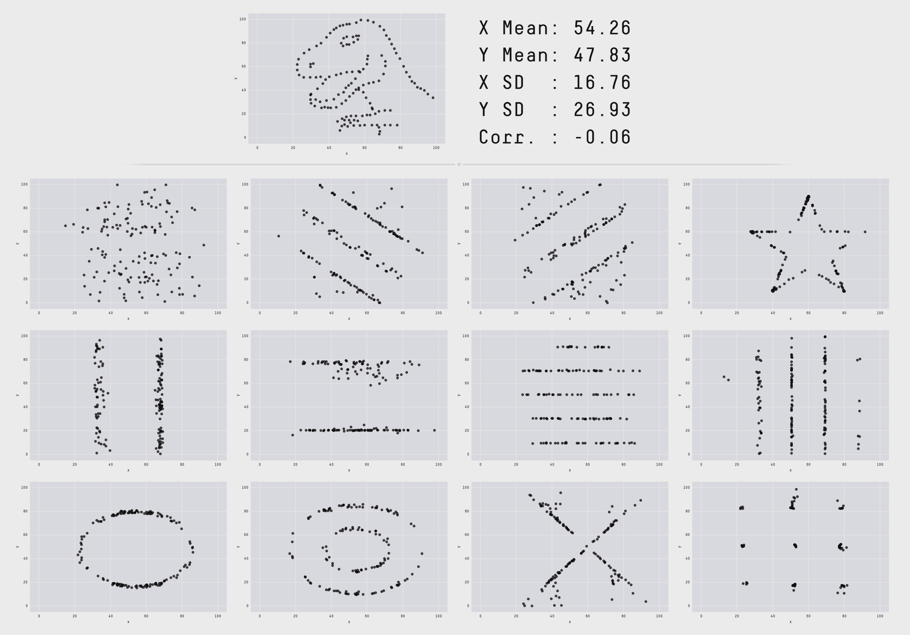
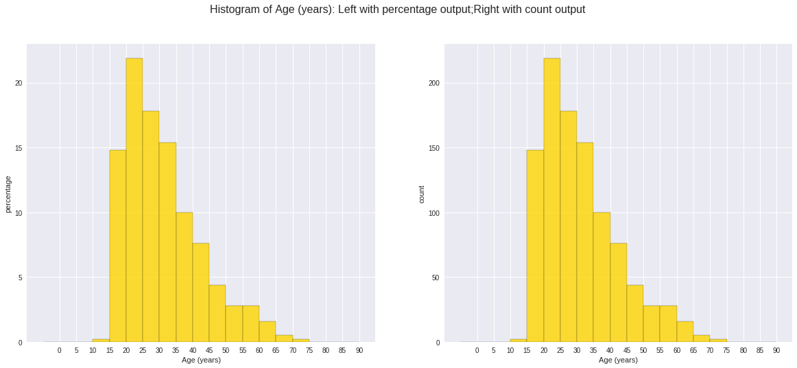
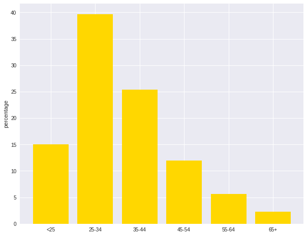
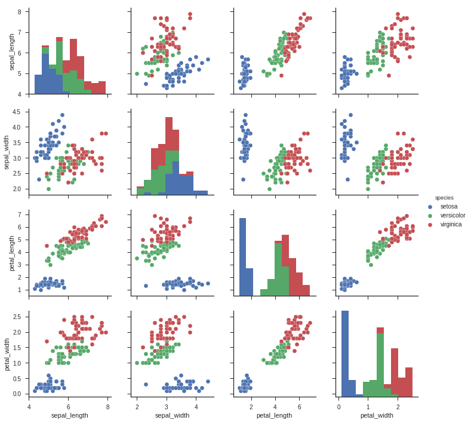

# 7\. Data Exploration

Chinese proverb

**A journey of a thousand miles begins with a single step** – idiom, from Laozi.

I wouldn’t say that understanding your dataset is the most difficult thing in data science, but it is really important and time-consuming. Data Exploration is about describing the data by means of statistical and visualization techniques. We explore data in order to understand the features and bring important features to our models.

## 7.1\. Univariate Analysis

In mathematics, univariate refers to an expression, equation, function or polynomial of only one variable. “Uni” means “one”, so in other words your data has only one variable. So you do not need to deal with the causes or relationships in this step. Univariate analysis takes data, summarizes that variables (attributes) one by one and finds patterns in the data.

There are many ways that can describe patterns found in univariate data include central tendency (mean, mode and median) and dispersion: range, variance, maximum, minimum, quartiles (including the interquartile range), coefficient of variation and standard deviation. You also have several options for visualizing and describing data with univariate data. Such as `frequency Distribution Tables`, `bar Charts`, `histograms`, `frequency Polygons`, `pie Charts`.

The variable could be either categorical or numerical, I will demostrate the different statistical and visulization techniques to investigate each type of the variable.

*   The Jupyter notebook can be download from [Data Exploration](_static/Data_exploration.ipynb).
*   The data can be downloaf from [German Credit](_static/german_credit.csv).

### 7.1.1\. Numerical Variables

*   Describe

The `desctibe` function in `pandas` and `spark` will give us most of the statistical results, such as `min`, `median`, `max`, `quartiles` and `standard deviation`. With the help of the user defined function, you can get even more statistical results.

```
# selected varables for the demonstration
num_cols = ['Account Balance','No of dependents']
df.select(num_cols).describe().show()

```

```
+-------+------------------+-------------------+
|summary|   Account Balance|   No of dependents|
+-------+------------------+-------------------+
|  count|              1000|               1000|
|   mean|             2.577|              1.155|
| stddev|1.2576377271108936|0.36208577175319395|
|    min|                 1|                  1|
|    max|                 4|                  2|
+-------+------------------+-------------------+

```

You may find out that the default function in PySpark does not include the quartiles. The following function will help you to get the same results in Pandas

```
def describe_pd(df_in, columns, deciles=False):
    '''
    Function to union the basic stats results and deciles
    :param df_in: the input dataframe
    :param columns: the cloumn name list of the numerical variable
    :param deciles: the deciles output

    :return : the numerical describe info. of the input dataframe

    :author: Ming Chen and Wenqiang Feng
    :email:  von198@gmail.com
    '''

    if deciles:
        percentiles = np.array(range(0, 110, 10))
    else:
        percentiles = [25, 50, 75]

    percs = np.transpose([np.percentile(df_in.select(x).collect(), percentiles) for x in columns])
    percs = pd.DataFrame(percs, columns=columns)
    percs['summary'] = [str(p) + '%' for p in percentiles]

    spark_describe = df_in.describe().toPandas()
    new_df = pd.concat([spark_describe, percs],ignore_index=True)
    new_df = new_df.round(2)
    return new_df[['summary'] + columns]

```

```
describe_pd(df,num_cols)

```

```
+-------+------------------+-----------------+
|summary|   Account Balance| No of dependents|
+-------+------------------+-----------------+
|  count|            1000.0|           1000.0|
|   mean|             2.577|            1.155|
| stddev|1.2576377271108936|0.362085771753194|
|    min|               1.0|              1.0|
|    max|               4.0|              2.0|
|    25%|               1.0|              1.0|
|    50%|               2.0|              1.0|
|    75%|               4.0|              1.0|
+-------+------------------+-----------------+

```

Sometimes, because of the confidential data issues, you can not deliver the real data and your clients may ask more statistical results, such as `deciles`. You can apply the follwing function to achieve it.

```
describe_pd(df,num_cols,deciles=True)

```

```
+-------+------------------+-----------------+
|summary|   Account Balance| No of dependents|
+-------+------------------+-----------------+
|  count|            1000.0|           1000.0|
|   mean|             2.577|            1.155|
| stddev|1.2576377271108936|0.362085771753194|
|    min|               1.0|              1.0|
|    max|               4.0|              2.0|
|     0%|               1.0|              1.0|
|    10%|               1.0|              1.0|
|    20%|               1.0|              1.0|
|    30%|               2.0|              1.0|
|    40%|               2.0|              1.0|
|    50%|               2.0|              1.0|
|    60%|               3.0|              1.0|
|    70%|               4.0|              1.0|
|    80%|               4.0|              1.0|
|    90%|               4.0|              2.0|
|   100%|               4.0|              2.0|
+-------+------------------+-----------------+

```

*   Skewness and Kurtosis

    This subsection comes from Wikipedia [Skewness](https://en.wikipedia.org/wiki/Skewness).

    In probability theory and statistics, skewness is a measure of the asymmetry of the probability distribution of a real-valued random variable about its mean. The skewness value can be positive or negative, or undefined.For a unimodal distribution, negative skew commonly indicates that the tail is on the left side of the distribution, and positive skew indicates that the tail is on the right.

    Consider the two distributions in the figure just below. Within each graph, the values on the right side of the distribution taper differently from the values on the left side. These tapering sides are called tails, and they provide a visual means to determine which of the two kinds of skewness a distribution has:

    1.  negative skew: The left tail is longer; the mass of the distribution is concentrated on the right of the figure. The distribution is said to be left-skewed, left-tailed, or skewed to the left, despite the fact that the curve itself appears to be skewed or leaning to the right; left instead refers to the left tail being drawn out and, often, the mean being skewed to the left of a typical center of the data. A left-skewed distribution usually appears as a right-leaning curve.
    2.  positive skew: The right tail is longer; the mass of the distribution is concentrated on the left of the figure. The distribution is said to be right-skewed, right-tailed, or skewed to the right, despite the fact that the curve itself appears to be skewed or leaning to the left; right instead refers to the right tail being drawn out and, often, the mean being skewed to the right of a typical center of the data. A right-skewed distribution usually appears as a left-leaning curve.

    This subsection comes from Wikipedia [Kurtosis](https://en.wikipedia.org/wiki/Kurtosis).

    In probability theory and statistics, kurtosis (kyrtos or kurtos, meaning “curved, arching”) is a measure of the “tailedness” of the probability distribution of a real-valued random variable. In a similar way to the concept of skewness, kurtosis is a descriptor of the shape of a probability distribution and, just as for skewness, there are different ways of quantifying it for a theoretical distribution and corresponding ways of estimating it from a sample from a population.


```
from pyspark.sql.functions import col, skewness, kurtosis
df.select(skewness(var),kurtosis(var)).show()

```

```
+---------------------+---------------------+
|skewness(Age (years))|kurtosis(Age (years))|
+---------------------+---------------------+
|   1.0231743160548064|   0.6114371688367672|
+---------------------+---------------------+

```

Warning

**Sometimes the statistics can be misleading!**

F. J. Anscombe once said that make both calculations and graphs. Both sorts of output should be studied; each will contribute to understanding. These 13 datasets in Figure [Same Stats, Different Graphs](#fig-misleading) (the Datasaurus, plus 12 others) each have the same summary statistics (x/y mean, x/y standard deviation, and Pearson’s correlation) to two decimal places, while being drastically different in appearance. This work describes the technique we developed to create this dataset, and others like it. More details and interesting results can be found in [Same Stats Different Graphs](https://www.autodeskresearch.com/publications/samestats).



Same Stats, Different Graphs

*   Histogram

Warning

**Histograms are often confused with Bar graphs!**

The fundamental difference between histogram and bar graph will help you to identify the two easily is that there are gaps between bars in a bar graph but in the histogram, the bars are adjacent to each other. The interested reader is referred to [Difference Between Histogram and Bar Graph](https://keydifferences.com/difference-between-histogram-and-bar-graph.html).

```
var = 'Age (years)'
x = data1[var]
bins = np.arange(0, 100, 5.0)

plt.figure(figsize=(10,8))
# the histogram of the data
plt.hist(x, bins, alpha=0.8, histtype='bar', color='gold',
         ec='black',weights=np.zeros_like(x) + 100\. / x.size)

plt.xlabel(var)
plt.ylabel('percentage')
plt.xticks(bins)
plt.show()

fig.savefig(var+".pdf", bbox_inches='tight')

```


```
var = 'Age (years)'
x = data1[var]
bins = np.arange(0, 100, 5.0)

########################################################################
hist, bin_edges = np.histogram(x,bins,
                               weights=np.zeros_like(x) + 100\. / x.size)
# make the histogram

fig = plt.figure(figsize=(20, 8))
ax = fig.add_subplot(1, 2, 1)

# Plot the histogram heights against integers on the x axis
ax.bar(range(len(hist)),hist,width=1,alpha=0.8,ec ='black', color='gold')
# # Set the ticks to the middle of the bars
ax.set_xticks([0.5+i for i,j in enumerate(hist)])
# Set the xticklabels to a string that tells us what the bin edges were
labels =['{}'.format(int(bins[i+1])) for i,j in enumerate(hist)]
labels.insert(0,'0')
ax.set_xticklabels(labels)
plt.xlabel(var)
plt.ylabel('percentage')

########################################################################

hist, bin_edges = np.histogram(x,bins) # make the histogram

ax = fig.add_subplot(1, 2, 2)
# Plot the histogram heights against integers on the x axis
ax.bar(range(len(hist)),hist,width=1,alpha=0.8,ec ='black', color='gold')

# # Set the ticks to the middle of the bars
ax.set_xticks([0.5+i for i,j in enumerate(hist)])

# Set the xticklabels to a string that tells us what the bin edges were
labels =['{}'.format(int(bins[i+1])) for i,j in enumerate(hist)]
labels.insert(0,'0')
ax.set_xticklabels(labels)
plt.xlabel(var)
plt.ylabel('count')
plt.suptitle('Histogram of {}: Left with percentage output;Right with count output'
             .format(var), size=16)
plt.show()

fig.savefig(var+".pdf", bbox_inches='tight')

```



Sometimes, some people will ask you to plot the unequal width (invalid argument for histogram) of the bars. YOu can still achieve it by the follwing trick.

```
var = 'Credit Amount'
plot_data = df.select(var).toPandas()
x= plot_data[var]

bins =[0,200,400,600,700,800,900,1000,2000,3000,4000,5000,6000,10000,25000]

hist, bin_edges = np.histogram(x,bins,weights=np.zeros_like(x) + 100\. / x.size) # make the histogram

fig = plt.figure(figsize=(10, 8))
ax = fig.add_subplot(1, 1, 1)
# Plot the histogram heights against integers on the x axis
ax.bar(range(len(hist)),hist,width=1,alpha=0.8,ec ='black',color = 'gold')

# # Set the ticks to the middle of the bars
ax.set_xticks([0.5+i for i,j in enumerate(hist)])

# Set the xticklabels to a string that tells us what the bin edges were
#labels =['{}k'.format(int(bins[i+1]/1000)) for i,j in enumerate(hist)]
labels =['{}'.format(bins[i+1]) for i,j in enumerate(hist)]
labels.insert(0,'0')
ax.set_xticklabels(labels)
#plt.text(-0.6, -1.4,'0')
plt.xlabel(var)
plt.ylabel('percentage')
plt.show()

```


*   Box plot and violin plot

Note that although violin plots are closely related to Tukey’s (1977) box plots, the violin plot can show more information than box plot. When we perform an exploratory analysis, nothing about the samples could be known. So the distribution of the samples can not be assumed to a normal distribution and usually when you get a big data, the normal distribution will show some out liars in box plot.

However, the violin plots are potentially misleading for smaller sample sizes, where the density plots can appear to show interesting features (and group-differences therein) even when produced for standard normal data. Some poster suggested the sample size should larger that 250\. The sample sizes (e.g. n&gt;250 or ideally even larger), where the kernel density plots provide a reasonably accurate representation of the distributions, potentially showing nuances such as bimodality or other forms of non-normality that would be invisible or less clear in box plots. More details can be found in [A simple comparison of box plots and violin plots](https://figshare.com/articles/A_simple_comparison_of_box_plots_and_violin_plots/1544525).

```
x = df.select(var).toPandas()

fig = plt.figure(figsize=(20, 8))
ax = fig.add_subplot(1, 2, 1)
ax = sns.boxplot(data=x)

ax = fig.add_subplot(1, 2, 2)
ax = sns.violinplot(data=x)

```


### 7.1.2\. Categorical Variables

Compared with the numerical variables, the categorical variables are much more easier to do the exploration.

*   Frequency table

```
from pyspark.sql import functions as F
from pyspark.sql.functions import rank,sum,col
from pyspark.sql import Window

window = Window.rowsBetween(Window.unboundedPreceding,Window.unboundedFollowing)
# withColumn('Percent %',F.format_string("%5.0f%%\n",col('Credit_num')*100/col('total'))).\
tab = df.select(['age_class','Credit Amount']).\
   groupBy('age_class').\
   agg(F.count('Credit Amount').alias('Credit_num'),
       F.mean('Credit Amount').alias('Credit_avg'),
       F.min('Credit Amount').alias('Credit_min'),
       F.max('Credit Amount').alias('Credit_max')).\
   withColumn('total',sum(col('Credit_num')).over(window)).\
   withColumn('Percent',col('Credit_num')*100/col('total')).\
   drop(col('total'))

```

```
+---------+----------+------------------+----------+----------+-------+
|age_class|Credit_num|        Credit_avg|Credit_min|Credit_max|Percent|
+---------+----------+------------------+----------+----------+-------+
|    45-54|       120|3183.0666666666666|       338|     12612|   12.0|
|      <25|       150| 2970.733333333333|       276|     15672|   15.0|
|    55-64|        56| 3493.660714285714|       385|     15945|    5.6|
|    35-44|       254| 3403.771653543307|       250|     15857|   25.4|
|    25-34|       397| 3298.823677581864|       343|     18424|   39.7|
|      65+|        23|3210.1739130434785|       571|     14896|    2.3|
+---------+----------+------------------+----------+----------+-------+

```

*   Pie plot

```
# Data to plot
labels = plot_data.age_class
sizes =  plot_data.Percent
colors = ['gold', 'yellowgreen', 'lightcoral','blue', 'lightskyblue','green','red']
explode = (0, 0.1, 0, 0,0,0)  # explode 1st slice

# Plot
plt.figure(figsize=(10,8))
plt.pie(sizes, explode=explode, labels=labels, colors=colors,
        autopct='%1.1f%%', shadow=True, startangle=140)

plt.axis('equal')
plt.show()

```


*   Bar plot

```
labels = plot_data.age_class
missing = plot_data.Percent
ind = [x for x, _ in enumerate(labels)]

plt.figure(figsize=(10,8))
plt.bar(ind, missing, width=0.8, label='missing', color='gold')

plt.xticks(ind, labels)
plt.ylabel("percentage")

plt.show()

```



```
labels = ['missing', '<25', '25-34', '35-44', '45-54','55-64','65+']
missing = np.array([0.000095, 0.024830, 0.028665, 0.029477, 0.031918,0.037073,0.026699])
man = np.array([0.000147, 0.036311, 0.038684, 0.044761, 0.051269, 0.059542, 0.054259])
women = np.array([0.004035, 0.032935, 0.035351, 0.041778, 0.048437, 0.056236,0.048091])
ind = [x for x, _ in enumerate(labels)]

plt.figure(figsize=(10,8))
plt.bar(ind, women, width=0.8, label='women', color='gold', bottom=man+missing)
plt.bar(ind, man, width=0.8, label='man', color='silver', bottom=missing)
plt.bar(ind, missing, width=0.8, label='missing', color='#CD853F')

plt.xticks(ind, labels)
plt.ylabel("percentage")
plt.legend(loc="upper left")
plt.title("demo")

plt.show()

```


## 7.2\. Multivariate Analysis

In this section, I will only demostrate the bivariate analysis. Since the multivariate analysis is the generation of the bivariate.

### 7.2.1\. Numerical V.S. Numerical

*   Correlation matrix

```
from pyspark.mllib.stat import Statistics
import pandas as pd

corr_data = df.select(num_cols)

col_names = corr_data.columns
features = corr_data.rdd.map(lambda row: row[0:])
corr_mat=Statistics.corr(features, method="pearson")
corr_df = pd.DataFrame(corr_mat)
corr_df.index, corr_df.columns = col_names, col_names

print(corr_df.to_string())

```

```
+--------------------+--------------------+
|     Account Balance|    No of dependents|
+--------------------+--------------------+
|                 1.0|-0.01414542650320914|
|-0.01414542650320914|                 1.0|
+--------------------+--------------------+

```

*   Scatter Plot

```
import seaborn as sns
sns.set(style="ticks")

df = sns.load_dataset("iris")
sns.pairplot(df, hue="species")
plt.show()

```



### 7.2.2\. Categorical V.S. Categorical

*   Pearson’s Chi-squared test

Warning

`pyspark.ml.stat` is only available in Spark 2.4.0.

```
from pyspark.ml.linalg import Vectors
from pyspark.ml.stat import ChiSquareTest

data = [(0.0, Vectors.dense(0.5, 10.0)),
        (0.0, Vectors.dense(1.5, 20.0)),
        (1.0, Vectors.dense(1.5, 30.0)),
        (0.0, Vectors.dense(3.5, 30.0)),
        (0.0, Vectors.dense(3.5, 40.0)),
        (1.0, Vectors.dense(3.5, 40.0))]
df = spark.createDataFrame(data, ["label", "features"])

r = ChiSquareTest.test(df, "features", "label").head()
print("pValues: " + str(r.pValues))
print("degreesOfFreedom: " + str(r.degreesOfFreedom))
print("statistics: " + str(r.statistics))

```

```
pValues: [0.687289278791,0.682270330336]
degreesOfFreedom: [2, 3]
statistics: [0.75,1.5]

```

*   Cross table

```
df.stat.crosstab("age_class", "Occupation").show()

```

```
+--------------------+---+---+---+---+
|age_class_Occupation|  1|  2|  3|  4|
+--------------------+---+---+---+---+
|                 <25|  4| 34|108|  4|
|               55-64|  1| 15| 31|  9|
|               25-34|  7| 61|269| 60|
|               35-44|  4| 58|143| 49|
|                 65+|  5|  3|  6|  9|
|               45-54|  1| 29| 73| 17|
+--------------------+---+---+---+---+

```

*   Stacked plot

```
labels = ['missing', '<25', '25-34', '35-44', '45-54','55-64','65+']
missing = np.array([0.000095, 0.024830, 0.028665, 0.029477, 0.031918,0.037073,0.026699])
man = np.array([0.000147, 0.036311, 0.038684, 0.044761, 0.051269, 0.059542, 0.054259])
women = np.array([0.004035, 0.032935, 0.035351, 0.041778, 0.048437, 0.056236,0.048091])
ind = [x for x, _ in enumerate(labels)]

plt.figure(figsize=(10,8))
plt.bar(ind, women, width=0.8, label='women', color='gold', bottom=man+missing)
plt.bar(ind, man, width=0.8, label='man', color='silver', bottom=missing)
plt.bar(ind, missing, width=0.8, label='missing', color='#CD853F')

plt.xticks(ind, labels)
plt.ylabel("percentage")
plt.legend(loc="upper left")
plt.title("demo")

plt.show()

```


### 7.2.3\. Numerical V.S. Categorical